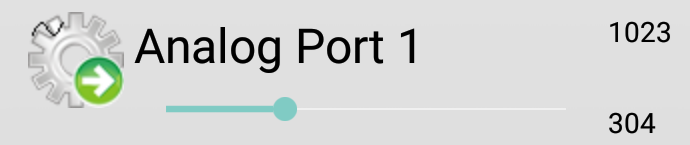
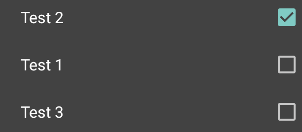
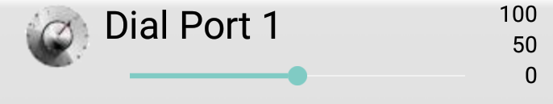

OPDID Automation Server Overview
================================

**OPDID** stands for "Open Protocol for Device Interaction Daemon". The OPDI protocol is a way of remote-controlling devices. 
OPDID extends this functionality by implementing automation functions. As such, it can be used for, e. g.:

* home automation
* data logging
* interactive art projects
* and many more. 

OPDID supports manual as well as automatic control of actors like lamps, dimmers, windows, shutters etc.
It also can read data from sensors like switches, analog inputs, weather stations, and others.

OPDID is written in mostly platform independent C and C++.
Its versatile standard functions allow you to get started quickly with your automation project.
It also integrates with operating system tools to read data from or interact with other processes.
For advances uses it features a plugin mechanism that allows you to write your own extensions to interface with custom devices.

OPDID is meant to run on hardware like the Raspberry Pi. To interface with your sensors and actors you will most likely
need additional interface electronics like buffers, relays, or A/D converters.

Basic concepts
--------------

Actors and sensors are internally represented as **ports**. Ports are the basic building blocks of every automation project.
Each port always has a well-defined state, depending on its type. A port can also be in an error state (for example, if a
sensor cannot be read). You can also think of ports as variables.

When a remote control application connects to OPDID (using the OPDI protocol), OPDID acts as a **slave**. The connecting app
is called the **master**. Information about the ports is sent to the master. The master's user interface displays
the ports and lets the user interact with the system by changing port settings and values.

Ports are of different types; each port type has specific capabilities and limitations. OPDID supports the following port types:

Digital port
~~~~~~~~~~~~

.. image:: images/digital_port.png

A digital port has only two states: **Low** and **High**. It is used for devices whose state is always known: for example, lamps
or switches (which can be either on or off). If the state is not always known, for example if the device is output only (like
certain radio controlled power sockets that do not support a status channel) a digital port is not used.

A digital port operates in either **Input**, **Output**, or **Bidirectional** mode. If you want to capture the input of a switch you could
use a digital port in Input mode. If you want to control a relay you should use a digital port in Output mode.
In rare occasions you might specify a digital port to operate in Bidirectional mode; in this case the user can select whether
the port is input or output.

Some devices might support different input modes with respect to connected resistors. OPDID digital ports support three different input modes:
**Floating**, **Input with pullup**, and **Input with pulldown** resistor. In most cases, though, the hardware wiring will already
define the resistor configuration so this distinction is less important.

A digital port is a purely logical or abstract concept for modeling automation processes. It does not necessarily correspond with physical
objects like IC pins, single relays, or lamps. A digital port could also be a group of devices switched on or off together, or it might
be a simple memory variable that controls the behaviour of other ports. It all depends on how the driver that implements a certain port
connects its logical state to the state of other things. This abstraction is part of what makes OPDID so versatile and powerful.

Analog port
~~~~~~~~~~~

An analog port is modeled after the A/D and D/A capabilities of microcontrollers. It supports a **Resolution** in bits
(currently, 9 to 12 bits are available) which defines its range; for example, a resolution of 10 bits will define a range of [0..1023].
Similar to a digital port it also features a **Mode** setting that specifies whether the analog port acts as an **Input**, **Output**
or **Bidirectional** port (in this case the user can select the direction themselves). The third parameter is the **Reference**:
some devices support internal or external reference voltages as basis for the conversion.

The state of an analog port is the value it has been set to, in case of Output mode; or the value that is read if it is working in Input mode.

Similar to digital ports, it's not necessary that there is actual A/D or D/A hardware behind an analog port. It might also be used to
model for example a volume control (though it's better to use a Dial port for this). It depends on the driver behind the analog port
how its value is set or read from the surroundings.

If the value of an analog port is used internally it is mapped to the range [0..1]. This way it doesn't matter which resolution setting
the port is currently being used.

Select port
~~~~~~~~~~~

A select port supports a number of discrete settings. The settings simply consist of labels of text, called **items**. The first item has
the number 0. The user can select one of the items on a connected master, and the selection will be sent to the slave.

A select port allows the user to make one of n choices whose meaning depends on the controlled device. For example, a window might support the
states Off, Closed and Open which could be conveniently modeled using a select port. Exactly how the selection is interpreted again depends
on the implementation of the driver that defines the select port.

Dial port
~~~~~~~~~

A dial port represents a 64 bit value with a **Minimum**, a **Maximum** and a **Step** setting. It is a very versatile port that can be used
to represent almost arbitrary numeric values. 

Code sample: ``dial_port = 100 * other_port;``

This is another code sample::

	// Convert a wide Unicode string to an UTF8 string
	std::string utf8_encode(const std::wstring &wstr)
	{
	    if (wstr.empty()) return std::string();
	    int size_needed = WideCharToMultiByte(CP_UTF8, 0, &wstr[0], (int)wstr.size(), NULL, 0, NULL, NULL);
	    std::string strTo(size_needed, 0);
	    WideCharToMultiByte(CP_UTF8, 0, &wstr[0], (int)wstr.size(), &strTo[0], size_needed, NULL, NULL);
	    return strTo;
	}

End of code sample. Also see the `OPDI reference <https://www.opdi.org>`_.

